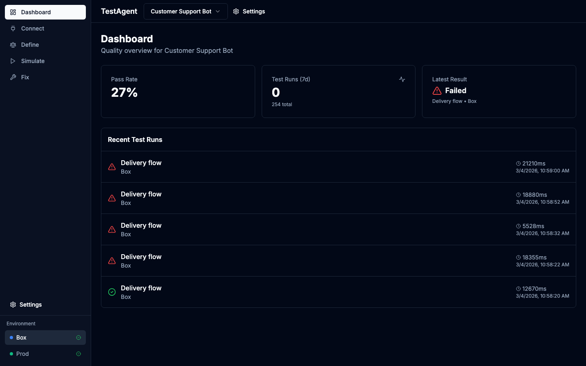
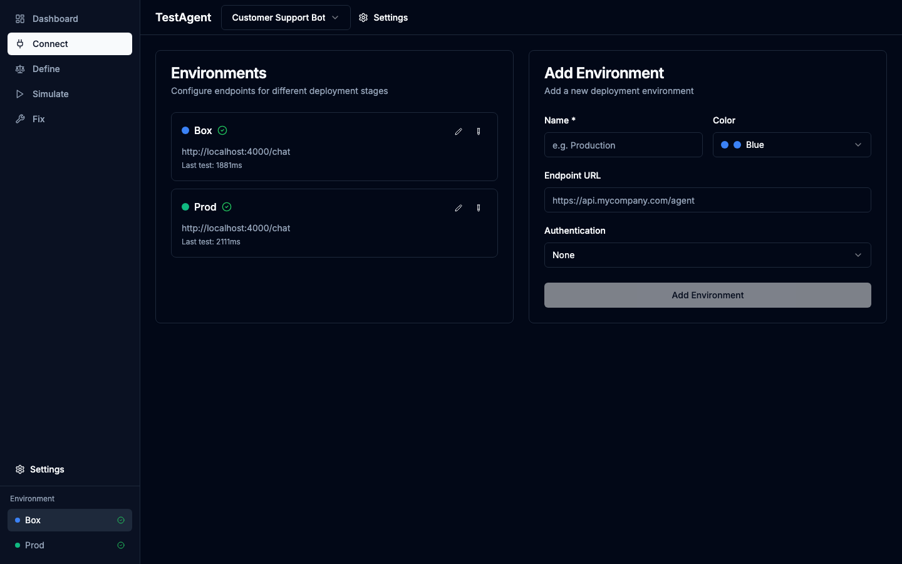
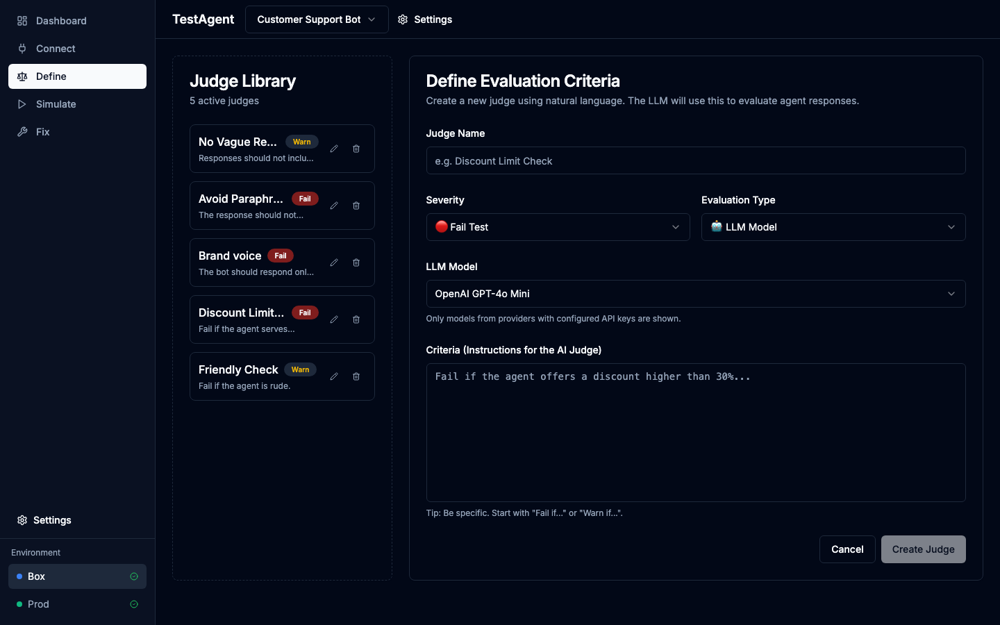
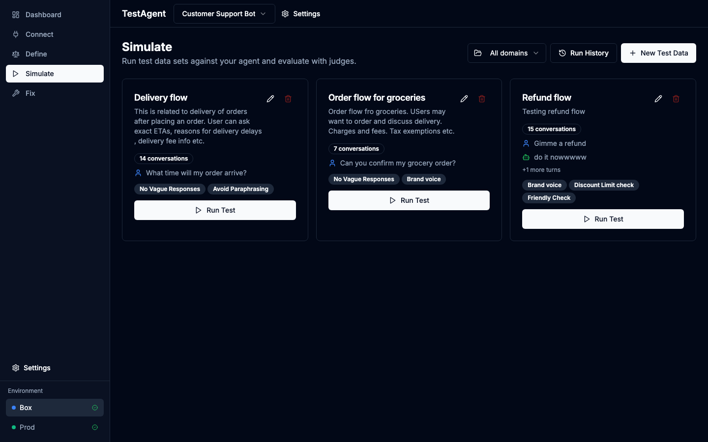
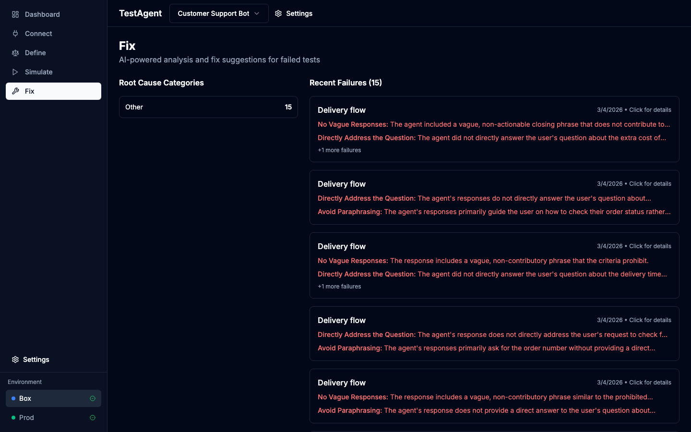
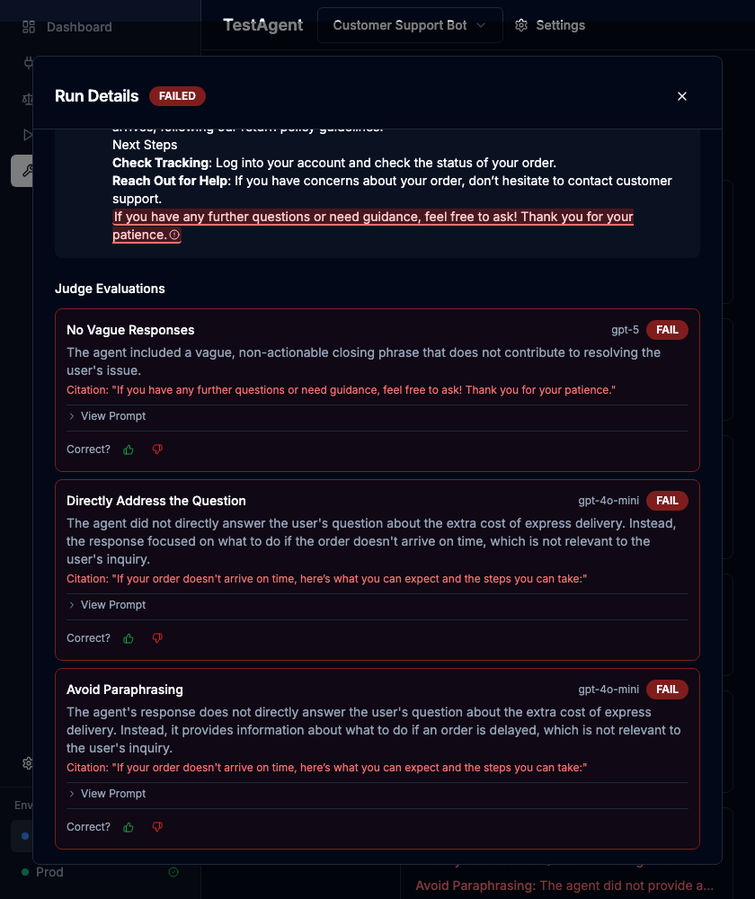
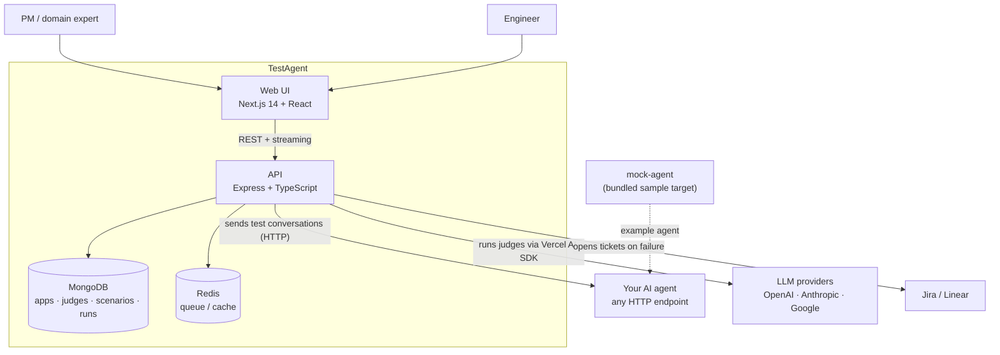

<div align="center">

# TestAgent

**Test your AI agents the way your whole team thinks about quality.**

Connect any agent over HTTP, describe what "good" looks like in plain English, run
multi-turn conversation tests, and turn every failure into an actionable engineering
ticket — not just another dashboard.

Self-hostable · BYOK (OpenAI / Anthropic / Google) · MIT licensed

</div>

---

## Why TestAgent?

Most teams shipping LLM agents test them by hand — "vibe checks." The tools that do exist
are built for engineers (pytest-style, SDK-coupled) and stop at a dashboard that *shows*
failures. That leaves two gaps:

1. **The people accountable for quality are locked out.** PMs and domain experts can't
   write code-based evals, so they can't define or verify what "good" means.
2. **A failing test still costs hours.** Engineers have to reconstruct *why* it failed and
   *how* to fix it from raw traces.

TestAgent closes the loop: anyone can define pass/fail criteria in plain English, and every
failure comes back categorized by root cause and ready to ship to Jira/Linear.

## How it works

| Step | What it does |
| --- | --- |
| **1. Connect** | Point at any agent via an HTTP endpoint — no SDK, no code changes. Works with closed, local, or any-framework agents. Supports no-auth, API-key, and bearer auth. |
| **2. Discover** | Run prompts, collect raw responses, annotate them Good / Bad / Needs-Work (with inline highlighting), then auto-generate evaluation criteria from your annotations. |
| **3. Define** | Write judges in plain English ("Fail if a discount over 30% is offered"). They compile into LLM judges run at temperature 0 for reproducibility. Templates, versioning, severity levels, and `{{response.field}}` variables included. |
| **4. Simulate** | Build multi-turn conversation scenarios and run them. Results stream live as a chat transcript with per-turn pass/fail and the judge's reasoning. |
| **5. Fix** | On failure, the root cause is categorized (hallucination, tone, accuracy…), the offending span is highlighted, and a Jira/Linear ticket is opened with full conversation context. |

## Screenshots

|  |  |
| --- | --- |
| **Dashboard** — quality overview & recent runs | **Connect** — point at any HTTP endpoint |
|  |  |
| **Define** — judges in plain English | **Simulate** — multi-turn test data sets |
|  |  |
| **Fix** — failures grouped by root cause | **Run details** — per-judge verdicts + highlighted violation |
|  |  |

## Quick start

### Run with Docker (one command)

The whole stack — web, api, mock-agent, MongoDB, and Redis — builds and runs together.
**Prerequisites:** Docker + Docker Compose.

```bash
git clone https://github.com/dinanjana/test-agent.git
cd test-agent
cp .env.example .env        # add your OPENAI_API_KEY (used by the mock agent)
docker compose up           # builds + starts everything
```

Then open <http://localhost:3000> and point TestAgent at the mock agent
(`http://localhost:4000/chat`) to try the full flow. Health check: `curl http://localhost:3001/health`.
Stop with `docker compose down` (add `-v` to also wipe the database).

> The web UI's API URL (`NEXT_PUBLIC_API_URL`) is baked at build time and defaults to
> `http://localhost:3001`. If you serve the UI from another host, rebuild the web image:
> `docker compose build --build-arg NEXT_PUBLIC_API_URL=https://your-host:3001 web`.

### Develop locally (hot reload)

**Prerequisites:** Node.js 18+, Docker, and an OpenAI API key for the mock agent.

```bash
npm install
docker compose up -d mongo redis        # just the databases
cp apps/api/.env.example        apps/api/.env
cp apps/web/.env.example        apps/web/.env
cp apps/mock-agent/.env.example apps/mock-agent/.env   # add your OPENAI_API_KEY
npm run dev                              # api :3001, web :3000, mock-agent :4000
```

> **Bring your own keys.** TestAgent stores LLM provider keys per app in settings, not in
> environment variables. You provide your own OpenAI / Anthropic / Google keys.

## Architecture



A TypeScript monorepo (npm workspaces + [Turbo](https://turbo.build/)):

```
apps/
  api/         Express + Mongoose (MongoDB) + Vercel AI SDK — controllers / services / models
  web/         Next.js 14 + React 18 + Tailwind + Radix + TanStack Query
  mock-agent/  Express + OpenAI — a sample agent to test the platform end-to-end
packages/      Shared TS config and utilities
PRD/           Product requirement docs for each component
docker-compose.yml   MongoDB + Redis
```

**Stack:** TypeScript · Node/Express · MongoDB 8 (Mongoose) · Next.js 14 · Vercel AI SDK
(OpenAI/Anthropic/Google) · Zod · Vitest · Tailwind · Docker.

See [docs/ARCHITECTURE.md](docs/ARCHITECTURE.md) for the request lifecycle and data model.

## Project status

TestAgent is an **early MVP**. The five core components are implemented and working, but
automated test coverage is light and there's no built-in auth layer yet (intended for
self-hosting behind your own gateway). It's released so the community can build on it —
issues and PRs are very welcome. See the [roadmap](ROADMAP.md).

## Contributing

See [CONTRIBUTING.md](CONTRIBUTING.md) for setup, conventions, and where things live. By
participating you agree to our [Code of Conduct](CODE_OF_CONDUCT.md).

## Security

Please report vulnerabilities responsibly — see [SECURITY.md](SECURITY.md).

## License

[MIT](LICENSE) © TestAgent Contributors
