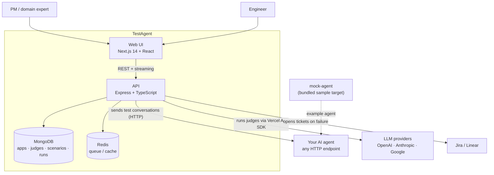
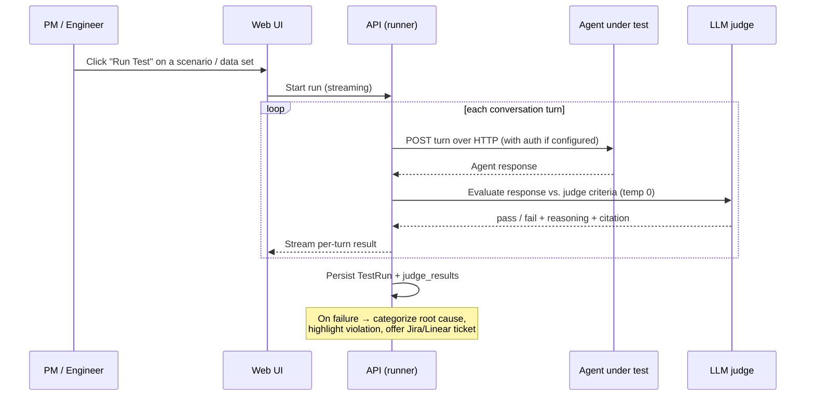

# Architecture

TestAgent is a TypeScript monorepo (npm workspaces + Turbo) made of three apps and a small
set of shared packages. It tests **black-box** AI agents: the agent under test is reached
over plain HTTP, so TestAgent never needs the agent's source, SDK, or framework.

## System overview

## Components

| App | Stack | Responsibility |
| --- | --- | --- |
| `apps/web` | Next.js 14, React 18, Tailwind, Radix, TanStack Query | The UI for all five flows (Connect, Discover, Define, Simulate, Fix). Single-page, component-driven navigation; talks to the API over REST + streaming. |
| `apps/api` | Express, Mongoose, Vercel AI SDK, Zod | The core. Organized into `controllers/` (HTTP handlers), `services/` (business logic — runner, judge, generate, analysis, environment), and `models/` (Mongoose schemas). |
| `apps/mock-agent` | Express, OpenAI | A sample HTTP agent so you can exercise the whole platform end-to-end without wiring up a real agent. |

Backing services (via `docker-compose.yml`): **MongoDB 8** (primary store) and **Redis 7**
(reserved for queue/cache).

## How a test run works

## Data model (MongoDB)

The hierarchy is **App → Domain → Test Data Set / Scenario → Test Run**, with **Judges**,
**Environments**, and **App Settings** attached per app.

| Model (`apps/api/src/models`) | Purpose |
| --- | --- |
| `app` | Top-level project being tested. |
| `domain` | Logical grouping within an app (scopes judges/data). |
| `environment` | A deployment endpoint for the agent (e.g. Staging, Prod) with auth config. |
| `agent` | A connected agent target. |
| `judge` | A natural-language evaluation rule compiled to an LLM judge (severity, criteria, template variables, versioning). |
| `scenario` / `testDataSet` | Multi-turn conversations / collected data to run against the agent. |
| `testRun` | The result of a run: per-turn responses, judge verdicts, pass/fail, timing. |
| `appSettings` | Per-app config including BYOK LLM provider keys. |

## Key design choices

- **Black-box / HTTP integration.** The agent under test is just a URL, so closed models,
  local models (Ollama/vLLM), and any framework all work the same way.
- **Plain-English judges, reproducible.** Criteria are written in natural language and run
  through an LLM judge at temperature 0 so verdicts are stable.
- **BYOK.** LLM provider keys live in per-app settings, not environment variables.
- **Close the loop.** A failure isn't a dead-end dashboard entry — it carries root cause,
  the highlighted offending span, and full context into a Jira/Linear ticket.

See the [`PRD/`](../PRD/README.md) folder for the original per-component specs.
